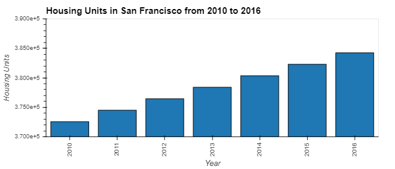
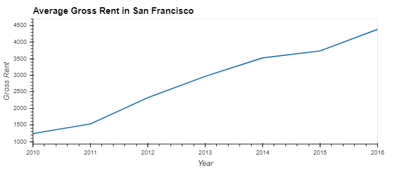
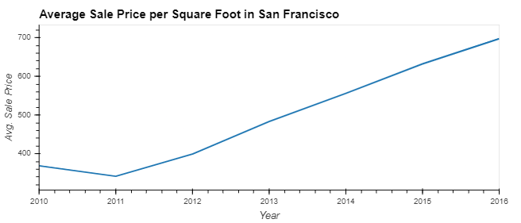
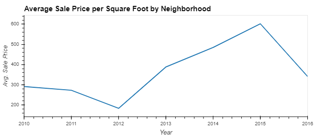
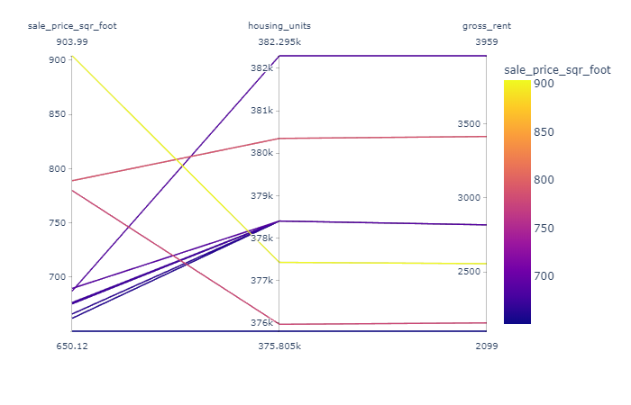
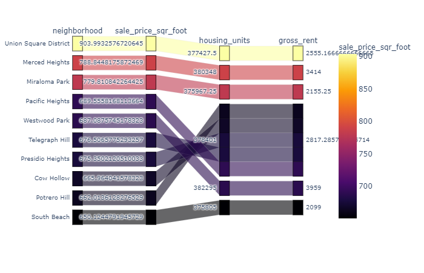
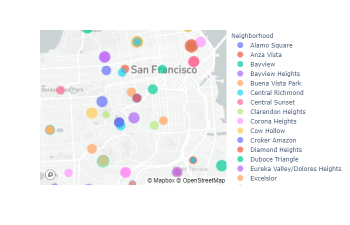

# Pythonic-Monopoly
PyViz Analysis

## SFO Housing Analysis

This report cover the SFO housing market between 2010 and 2016.

   

### Averages

* Average Gross Rent in San Francisco Per Year

   

* Average Sales Price per Year

   

* Average Prices by Neighborhood

   

### Top 10
* The Top 10 Most Expensive Neighborhoods

   

* Parallel Coordinates Analysis

   

* Parallel Categories Analysis

   

### Neighborhood Map

   

### Dashboard
The Dashboard contains three tabs:
* Averages
* Top 10
* Neighborhood Map
